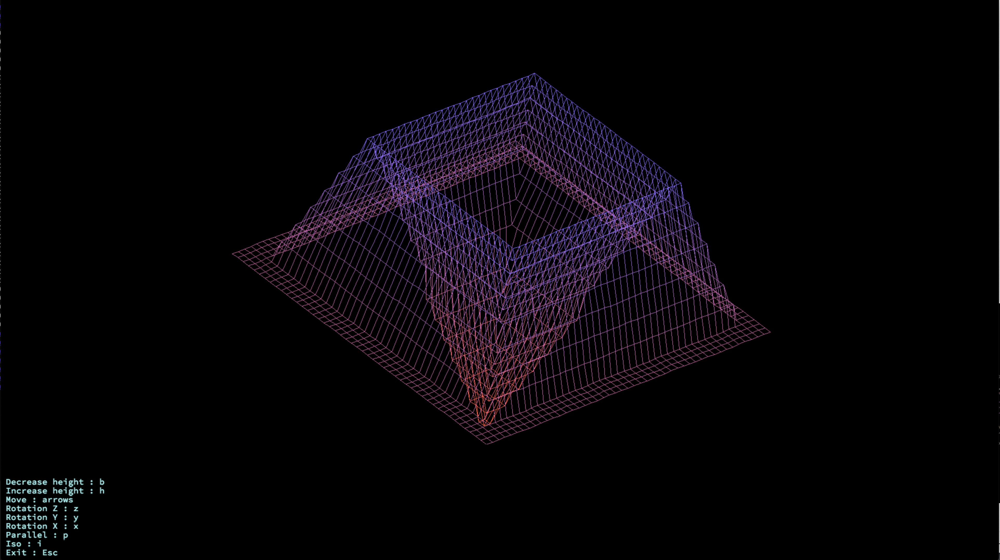
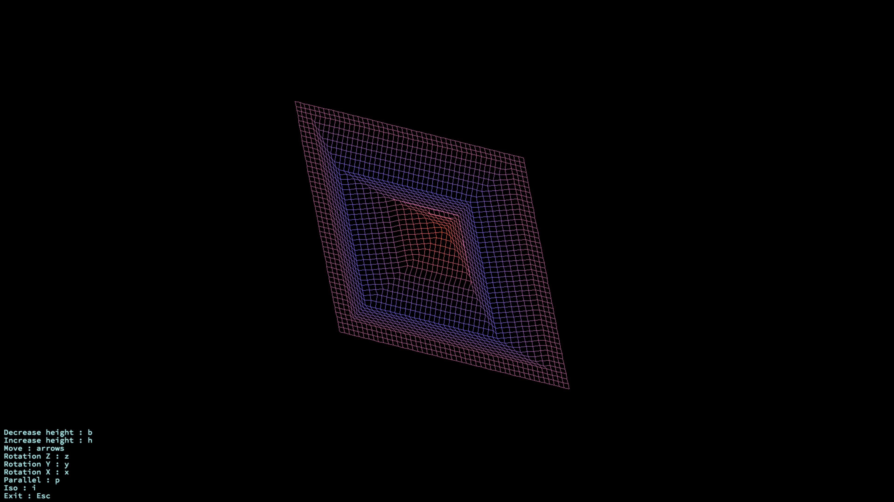
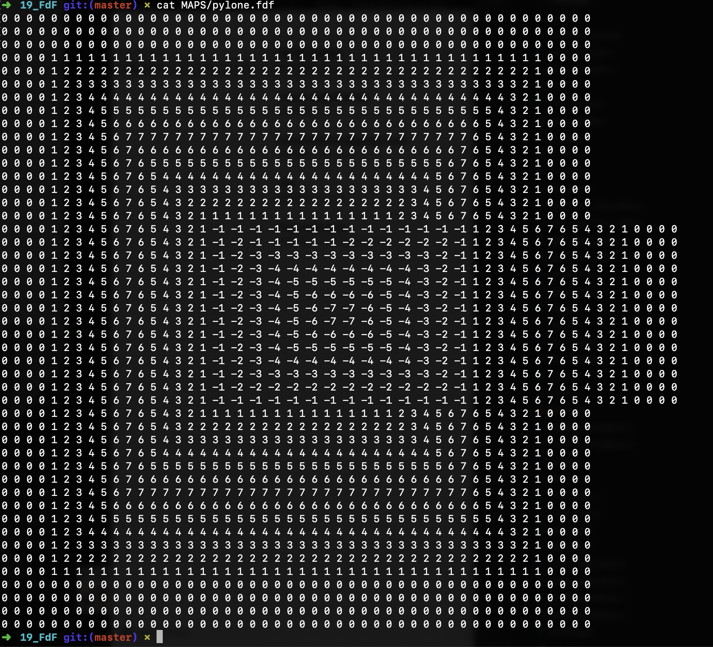
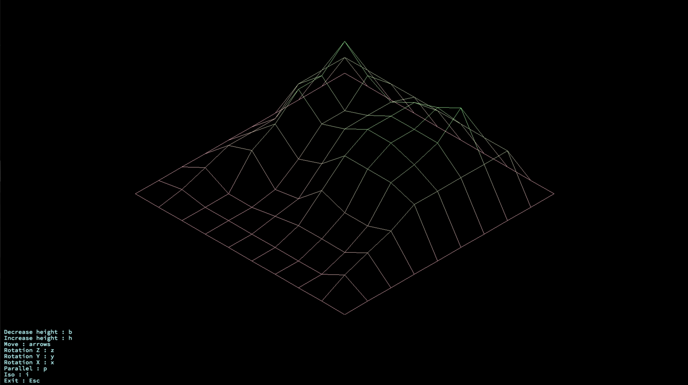
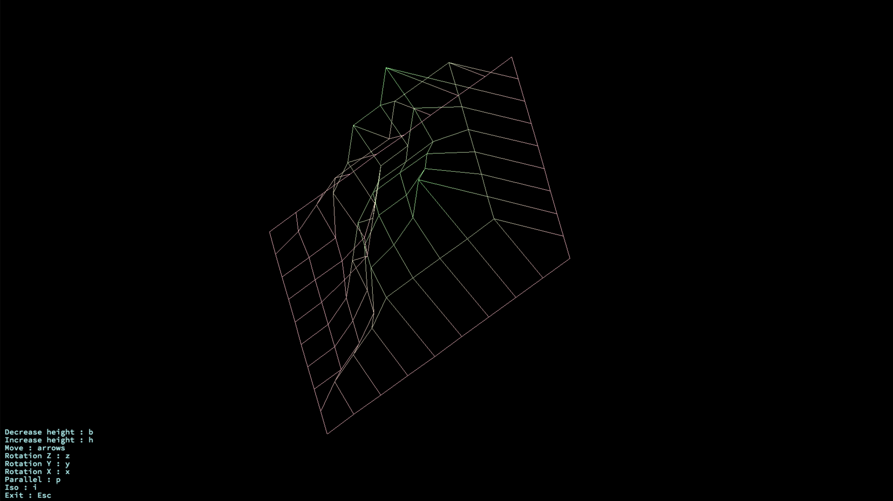
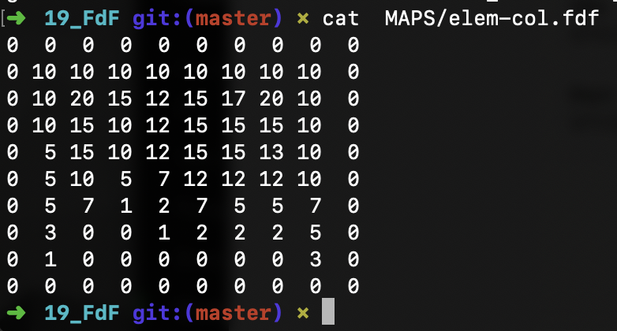

All programs that you wrote until now were executed in text mode on your terminal. Now, let’s discover something more exciting: how to open a graphics window and draw inside? To start your journey in graphic programming, FdF offers to represent “iron wire” meshing in 3D.

make
./fdf [path to map]

◦ Press b to decrease the height and i to increase it.  

◦ Use the left and right arrows to move the drawing in the window  

◦ Press Z, X or Y to perform rotations on the Z, X or Y axis respectively  

◦ Press p to switch to a parallel projection and i to come back to the isometric one (the isometric one is the default)  

◦ Press Esc to exit  

			

